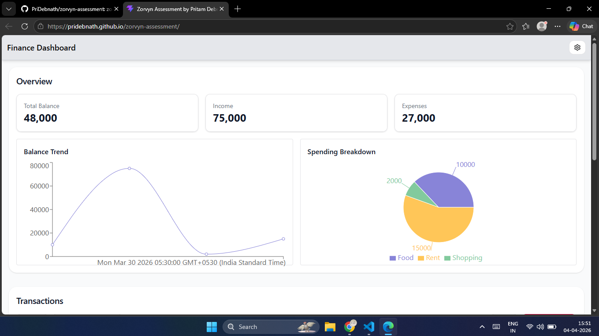
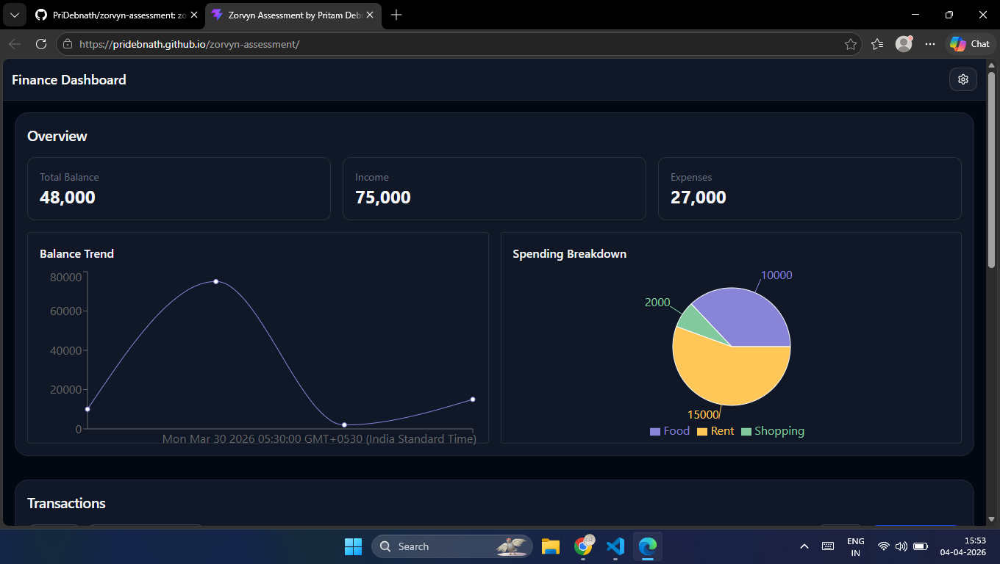
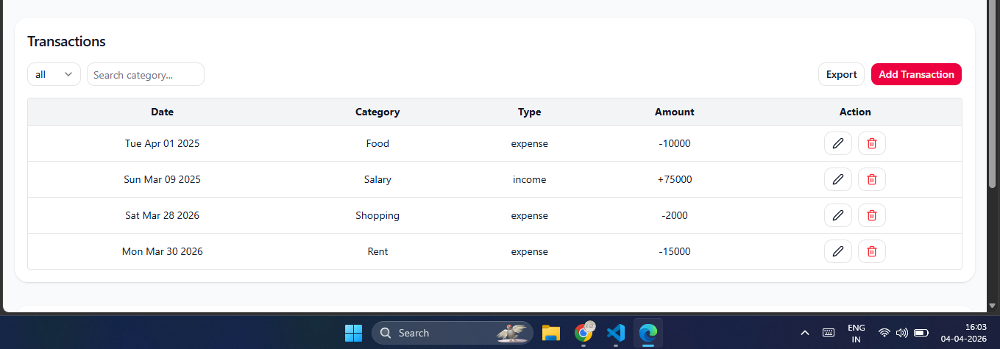
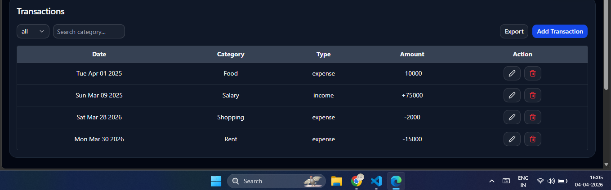
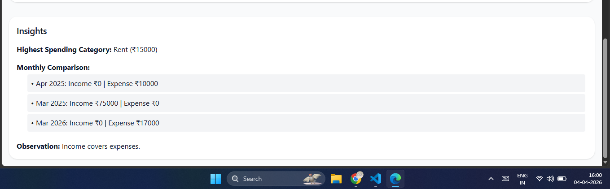
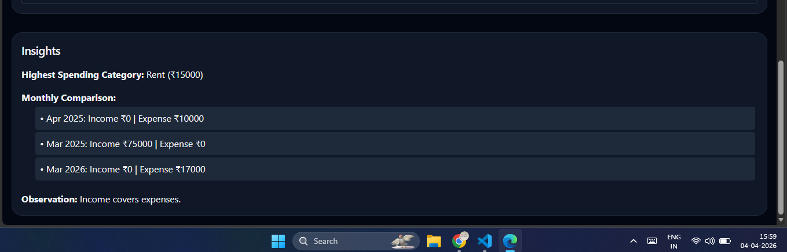

## 📌 Overview

This project is a Finance Dashboard UI built as part of the Zorvyn Frontend Developer Internship assignment.
---
## 🔴 Demo

### 🔴 🖼️ Screenshot

#### 🔴 Overview (Light Mode)
<a href="https://pridebnath.github.io/zorvyn-assessment/">

</a>

#### 🔴 Overview (Dark Mode)
<a href="https://pridebnath.github.io/zorvyn-assessment/">

</a>

#### 🔴 Transactions (Light Mode)
<a href="https://pridebnath.github.io/zorvyn-assessment/">

</a>

#### 🔴 Transactions (Dark Mode)
<a href="https://pridebnath.github.io/zorvyn-assessment/">

</a>

#### 🔴 Insights (Light Mode)
<a href="https://pridebnath.github.io/zorvyn-assessment/">

</a>

#### 🔴 Insights (Dark Mode)
<a href="https://pridebnath.github.io/zorvyn-assessment/">

</a>

 


### 🔴 ↗️ Link
https://pridebnath.github.io/zorvyn-assessment/

---
## Features
### Dashboard Overview
- Summary cards:
  - Total Balance
  - Income
  - Expenses
- Line Chart (Recharts) for balance trend
- Pie Chart (Recharts) for spending breakdown

### Transactions Section
- Displays transaction list with:
  - Date
  - Category
  - Type (Income/Expense)
  - Amount
- Features:
  - Filter by type (All / Income / Expense)
  - Search by category
  - Handles empty state gracefully


### Insights Section
- Displays useful financial insights:
  - Highest spending category
  -  Monthly comparison
  - Savings rate
  
### Role-Based UI (Simulated in Setting)
- Role switcher: Admin / Viewer
- Viewer:
  - Can only view data
- Admin:
  - Can see Edit/Delete actions
  - Can access Add Transaction button
  

---
# Set Up 
## Frontend Set Up
```
npm run corepack:enable
``` 
```
pnpm install
``` 

```
npm run dev
``` 
 
 ---